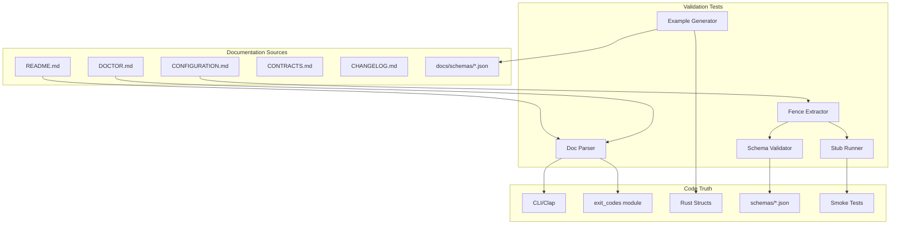

# Design Document

## Overview

This design covers comprehensive validation of all xchecker documentation to ensure accuracy and alignment with the current implementation. The approach uses automated testing to verify that documentation claims are true, examples are runnable, and schemas match Rust structs.

### Core Design Principles

1. **Single Source of Truth**: Code is truth; documentation is verified against code
2. **Automated Verification**: All documentation claims must be testable in CI
3. **Stub Mode Execution**: Examples run in isolated environments without external dependencies
4. **Generated Examples**: Schema examples are generated from constructors, never hand-written
5. **Continuous Validation**: Documentation tests run on every CI build

## Architecture

### High-Level Components



## Components and Interfaces

### 1. Documentation Parser

**Purpose:** Extract structured information from markdown documentation.

**Implementation:**

```rust
pub struct DocParser {
    content: String,
}

impl DocParser {
    pub fn new(path: &Path) -> Result<Self> {
        let content = std::fs::read_to_string(path)?;
        Ok(Self { content })
    }
    
    /// Extract command names from headers like "### `xchecker spec <spec-id>`"
    pub fn extract_commands(&self) -> Vec<String> {
        let re = Regex::new(r"###\s+`xchecker\s+(\w+)").unwrap();
        re.captures_iter(&self.content)
            .filter_map(|cap| cap.get(1).map(|m| m.as_str().to_string()))
            .collect()
    }
    
    /// Extract CLI options from documentation
    pub fn extract_options(&self, command: &str) -> Vec<String> {
        // Find section for command, extract --option patterns
        let re = Regex::new(r"`--([\w-]+)").unwrap();
        re.captures_iter(&self.content)
            .filter_map(|cap| cap.get(1).map(|m| m.as_str().to_string()))
            .collect()
    }
    
    /// Extract exit code table
    pub fn extract_exit_codes(&self) -> HashMap<i32, String> {
        // Parse markdown table with | Code | Name | Description |
        let mut codes = HashMap::new();
        let re = Regex::new(r"\|\s*(\d+)\s*\|\s*`(\w+)`").unwrap();
        for cap in re.captures_iter(&self.content) {
            if let (Some(code), Some(name)) = (cap.get(1), cap.get(2)) {
                codes.insert(code.as_str().parse().unwrap(), name.as_str().to_string());
            }
        }
        codes
    }
}
```

### 2. Fenced Block Extractor

**Purpose:** Extract code blocks from markdown for validation using robust AST parsing.

**Implementation:**

```rust
use pulldown_cmark::{Parser, Event, Tag, CodeBlockKind};

pub struct FencedBlock {
    pub language: String,
    pub content: String,
    pub metadata: HashMap<String, String>,
}

pub struct FenceExtractor {
    content: String,
}

impl FenceExtractor {
    pub fn new(path: &Path) -> Result<Self> {
        let content = std::fs::read_to_string(path)?;
        Ok(Self { content })
    }
    
    /// Extract all fenced code blocks using pulldown_cmark AST
    /// Handles multi-line fences, backtick variations, tilde fences, and nested blocks
    pub fn extract_blocks(&self) -> Vec<FencedBlock> {
        let mut blocks = vec![];
        let parser = Parser::new(&self.content);
        let mut current_lang: Option<String> = None;
        let mut current_meta: HashMap<String, String> = HashMap::new();
        let mut buffer = String::new();
        
        for event in parser {
            match event {
                Event::Start(Tag::CodeBlock(CodeBlockKind::Fenced(info))) => {
                    let info_str = info.to_string();
                    let mut parts = info_str.split_whitespace();
                    current_lang = parts.next().map(|s| s.to_string());
                    
                    // Parse metadata from remaining parts
                    let metadata_str = parts.collect::<Vec<_>>().join(" ");
                    current_meta = Self::parse_metadata(&metadata_str);
                }
                Event::Text(text) if current_lang.is_some() => {
                    buffer.push_str(&text);
                }
                Event::End(Tag::CodeBlock(_)) => {
                    if let Some(lang) = current_lang.take() {
                        blocks.push(FencedBlock {
                            language: lang,
                            content: std::mem::take(&mut buffer),
                            metadata: std::mem::take(&mut current_meta),
                        });
                    }
                }
                _ => {}
            }
        }
        
        blocks
    }
    
    fn parse_metadata(s: &str) -> HashMap<String, String> {
        // Parse key=value pairs, handling quoted values
        // Use shell_words for proper parsing of quoted strings
        shell_words::split(s)
            .unwrap_or_default()
            .into_iter()
            .filter_map(|pair| {
                let parts: Vec<_> = pair.splitn(2, '=').collect();
                if parts.len() == 2 {
                    Some((parts[0].to_string(), parts[1].to_string()))
                } else {
                    None
                }
            })
            .collect()
    }
    
    pub fn extract_by_language(&self, lang: &str) -> Vec<FencedBlock> {
        self.extract_blocks()
            .into_iter()
            .filter(|block| block.language == lang)
            .collect()
    }
}
```

### 3. Example Generator

**Purpose:** Generate schema examples from Rust struct constructors.

**Implementation:**

```rust
pub mod example_generators {
    use crate::types::*;
    use chrono::Utc;
    use std::collections::BTreeMap;
    
    /// Generate minimal receipt example (required fields only)
    /// Uses fixed timestamp for deterministic output
    pub fn make_example_receipt_minimal() -> Receipt {
        Receipt {
            schema_version: "1".to_string(),
            emitted_at: fixed_timestamp(),
            spec_id: "example-spec".to_string(),
            phase: "requirements".to_string(),
            xchecker_version: "0.1.0".to_string(),
            claude_cli_version: "0.8.1".to_string(),
            model_full_name: "claude-3-5-sonnet-20241022".to_string(),
            model_alias: None,
            canonicalization_version: "yaml-v1,md-v1".to_string(),
            canonicalization_backend: "jcs-rfc8785".to_string(),
            flags: BTreeMap::new(),
            runner: "native",
            runner_distro: None,
            packet: PacketEvidence::default(),
            outputs: vec![],
            exit_code: 0,
            error_kind: None,
            error_reason: None,
            stderr_tail: None,
            warnings: vec![],
            fallback_used: false,
        }
    }
    
    /// Generate full receipt example (all fields populated)
    /// Uses BTreeMap for deterministic key order and sorts arrays
    pub fn make_example_receipt_full() -> Receipt {
        let mut flags = BTreeMap::new();
        flags.insert("dry_run".to_string(), "true".to_string());
        flags.insert("strict_lock".to_string(), "false".to_string());
        
        let mut outputs = vec![
            FileHash {
                path: "artifacts/10-design.md".to_string(),
                blake3_first8: "fedcba98".to_string(), // Match schema constraint: 8 hex chars
            },
            FileHash {
                path: "artifacts/00-requirements.md".to_string(),
                blake3_first8: "abc12345".to_string(),
            },
        ];
        // Sort by path for deterministic output
        outputs.sort_by(|a, b| a.path.cmp(&b.path));
        
        Receipt {
            schema_version: "1".to_string(),
            emitted_at: fixed_timestamp(),
            spec_id: "example-spec".to_string(),
            phase: "design".to_string(),
            xchecker_version: "0.1.0".to_string(),
            claude_cli_version: "0.8.1".to_string(),
            model_full_name: "claude-3-5-sonnet-20241022".to_string(),
            model_alias: Some("sonnet".to_string()),
            canonicalization_version: "yaml-v1,md-v1".to_string(),
            canonicalization_backend: "jcs-rfc8785".to_string(),
            flags,
            runner: "wsl",
            runner_distro: Some("Ubuntu-22.04".to_string()),
            packet: PacketEvidence::default(),
            outputs,
            exit_code: 0,
            error_kind: None,
            error_reason: None,
            stderr_tail: Some("Warning: large packet".to_string()),
            warnings: vec!["rename_retry_count: 2".to_string()],
            fallback_used: true,
        }
    }
    
    // Similar functions for status and doctor...
    pub fn make_example_status_minimal() -> StatusOutput { /* ... */ }
    pub fn make_example_status_full() -> StatusOutput { /* ... */ }
    pub fn make_example_doctor_minimal() -> DoctorOutput { /* ... */ }
    pub fn make_example_doctor_full() -> DoctorOutput { /* ... */ }
    
    /// Fixed timestamp for deterministic examples
    fn fixed_timestamp() -> DateTime<Utc> {
        DateTime::parse_from_rfc3339("2025-01-01T00:00:00Z")
            .unwrap()
            .with_timezone(&Utc)
    }
}
```

### 4. Schema Validator

**Purpose:** Validate JSON against JSON Schema using jsonschema 0.33+ API.

**Implementation:**

```rust
use jsonschema::validator_for;
use serde_json::Value;

pub struct SchemaValidator {
    schemas: HashMap<String, Value>,
}

impl SchemaValidator {
    pub fn new() -> Result<Self> {
        let mut schemas = HashMap::new();
        
        // Load all schemas
        for schema_name in &["receipt.v1", "status.v1", "doctor.v1"] {
            let path = format!("schemas/{}.json", schema_name);
            let schema_json: Value = serde_json::from_str(&std::fs::read_to_string(&path)?)?;
            schemas.insert(schema_name.to_string(), schema_json);
        }
        
        Ok(Self { schemas })
    }
    
    pub fn validate(&self, schema_name: &str, instance: &Value) -> Result<()> {
        let schema = self.schemas.get(schema_name)
            .ok_or_else(|| anyhow::anyhow!("Schema not found: {}", schema_name))?;
        
        // Use jsonschema 0.33+ API
        let validator = validator_for(schema)?;
        
        if let Err(errors) = validator.validate(instance) {
            let error_msgs: Vec<_> = errors.into_iter()
                .map(|e| e.to_string())
                .collect();
            return Err(anyhow::anyhow!(
                "Schema validation errors:\n{}",
                error_msgs.join("\n")
            ));
        }
        
        Ok(())
    }
}
```

### 5. Stub Runner

**Purpose:** Execute commands in isolated stub mode using assert_cmd for robust testing.

**Implementation:**

```rust
use assert_cmd::Command;
use predicates::prelude::*;
use tempfile::TempDir;

pub struct StubRunner {
    home_dir: TempDir,
}

impl StubRunner {
    pub fn new() -> Result<Self> {
        Ok(Self {
            home_dir: TempDir::new()?,
        })
    }
    
    pub fn run_command(&self, cmd_line: &str, expected_exit: i32) -> Result<CommandResult> {
        // Parse command with shell_words for proper quote handling
        let parts = shell_words::split(cmd_line)?;
        if parts.is_empty() {
            return Err(anyhow::anyhow!("Empty command"));
        }
        
        let binary = &parts[0];
        let args = &parts[1..];
        
        // Use assert_cmd for robust command execution
        let assert = Command::cargo_bin(binary)?
            .env("XCHECKER_HOME", self.home_dir.path())
            .env("RUNNER", "native-stub")
            .args(args)
            .assert();
        
        // Check exit code
        let output = assert.get_output();
        let actual_exit = output.status.code().unwrap_or(-1);
        
        if actual_exit != expected_exit {
            return Err(anyhow::anyhow!(
                "Exit code mismatch: expected {}, got {}",
                expected_exit,
                actual_exit
            ));
        }
        
        Ok(CommandResult {
            exit_code: actual_exit,
            stdout: String::from_utf8_lossy(&output.stdout).to_string(),
            stderr: String::from_utf8_lossy(&output.stderr).to_string(),
        })
    }
}

pub struct CommandResult {
    pub exit_code: i32,
    pub stdout: String,
    pub stderr: String,
}
```

### 6. CLI Verifier

**Purpose:** Verify CLI structure matches documentation.

**Implementation:**

```rust
use clap::Command;

pub struct CliVerifier {
    app: Command,
}

impl CliVerifier {
    pub fn new() -> Self {
        // Build the CLI app (same as main.rs)
        Self {
            app: crate::cli::build_cli(),
        }
    }
    
    pub fn verify_command_exists(&self, name: &str) -> bool {
        self.app.find_subcommand(name).is_some()
    }
    
    pub fn verify_option_exists(&self, command: &str, option: &str) -> bool {
        if let Some(subcmd) = self.app.find_subcommand(command) {
            subcmd.get_arguments()
                .any(|arg| arg.get_long() == Some(option))
        } else {
            false
        }
    }
    
    pub fn get_all_commands(&self) -> Vec<String> {
        self.app.get_subcommands()
            .map(|cmd| cmd.get_name().to_string())
            .collect()
    }
}
```

### 7. Schema-Rust Conformance Checker

**Purpose:** Verify JSON schemas match Rust struct definitions using strum for enum introspection.

**Implementation:**

```rust
use serde_json::Value;
use strum::VariantNames;

pub struct SchemaRustChecker;

impl SchemaRustChecker {
    /// Verify enum variants match between schema and Rust using strum
    /// Requires #[derive(EnumVariantNames)] on the enum
    pub fn verify_enum_variants<T: VariantNames>(
        schema_path: &str,
        enum_path: &str,
        rename_all: RenameAll,
    ) -> Result<()> {
        let schema: Value = serde_json::from_str(&std::fs::read_to_string(schema_path)?)?;
        
        // Navigate to enum definition in schema
        let schema_enum = schema
            .pointer(enum_path)
            .and_then(|v| v.get("enum"))
            .and_then(|v| v.as_array())
            .ok_or_else(|| anyhow::anyhow!("Enum not found in schema at {}", enum_path))?;
        
        let schema_variants: HashSet<String> = schema_enum
            .iter()
            .filter_map(|v| v.as_str().map(|s| s.to_string()))
            .collect();
        
        // Get Rust variants and apply serde rename_all transformation
        let rust_variants: HashSet<String> = T::VARIANTS
            .iter()
            .map(|v| rename_all.apply(v))
            .collect();
        
        if rust_variants != schema_variants {
            return Err(anyhow::anyhow!(
                "Enum mismatch at {}:\nRust: {:?}\nSchema: {:?}",
                enum_path,
                rust_variants,
                schema_variants
            ));
        }
        
        Ok(())
    }
    
    /// Verify required fields match non-Option fields
    /// rust_required should be a static list of non-Option field names
    pub fn verify_required_fields(
        schema_path: &str,
        rust_required: &[&str],
    ) -> Result<()> {
        let schema: Value = serde_json::from_str(&std::fs::read_to_string(schema_path)?)?;
        
        let schema_required = schema
            .get("required")
            .and_then(|v| v.as_array())
            .ok_or_else(|| anyhow::anyhow!("Required fields not found in schema"))?;
        
        let schema_fields: HashSet<String> = schema_required
            .iter()
            .filter_map(|v| v.as_str().map(|s| s.to_string()))
            .collect();
        
        let rust_fields: HashSet<String> = rust_required
            .iter()
            .map(|s| s.to_string())
            .collect();
        
        if rust_fields != schema_fields {
            return Err(anyhow::anyhow!(
                "Required fields mismatch:\nRust: {:?}\nSchema: {:?}",
                rust_fields,
                schema_fields
            ));
        }
        
        Ok(())
    }
}

/// Helper for applying serde rename_all transformations
pub enum RenameAll {
    SnakeCase,
    Lowercase,
    // Add others as needed
}

impl RenameAll {
    pub fn apply(&self, s: &str) -> String {
        match self {
            RenameAll::SnakeCase => {
                // Convert PascalCase to snake_case
                let mut result = String::new();
                for (i, ch) in s.chars().enumerate() {
                    if ch.is_uppercase() && i > 0 {
                        result.push('_');
                    }
                    result.push(ch.to_lowercase().next().unwrap());
                }
                result
            }
            RenameAll::Lowercase => s.to_lowercase(),
        }
    }
}
```

## Data Models

### Test Organization

```
tests/
  doc_validation/
    mod.rs                    # Test module setup
    readme_tests.rs           # R1: README verification
    schema_examples_tests.rs  # R2: Schema example validation
    config_tests.rs           # R3: Configuration doc tests
    doctor_tests.rs           # R4: Doctor doc tests
    contracts_tests.rs        # R5: Contracts doc tests
    schema_rust_tests.rs      # R6: Schema-Rust conformance
    changelog_tests.rs        # R7: Changelog verification
    xchecker_home_tests.rs    # R8: XCHECKER_HOME docs
    code_examples_tests.rs    # R9: Code example execution
    feature_tests.rs          # R10: Feature documentation
```

## Testing Strategy

### Unit Tests

Each component has unit tests:

- `DocParser`: Test regex extraction with sample markdown
- `FenceExtractor`: Test block extraction with various fence formats
- `ExampleGenerator`: Verify generated examples are valid
- `SchemaValidator`: Test validation with valid/invalid JSON
- `StubRunner`: Test command execution in isolation

### Integration Tests

Full documentation validation tests:

1. **README Command Verification** (`readme_tests.rs`)
   - Extract commands from README
   - Verify each exists in CLI
   - Extract options per command
   - Verify each option exists
   - Extract and verify exit code table

2. **Schema Example Validation** (`schema_examples_tests.rs`)
   - Generate examples from constructors
   - Validate against schemas
   - Verify array sorting
   - Write to docs/schemas/ and re-validate

3. **Configuration Tests** (`config_tests.rs`)
   - Extract TOML blocks
   - Parse into Config
   - Test precedence with multiple sources
   - Verify defaults match Config::default()

4. **Doctor Tests** (`doctor_tests.rs`)
   - Run doctor in stub mode
   - Verify checks exist
   - Force failures and verify exit codes
   - Validate output against schema

5. **Schema-Rust Conformance** (`schema_rust_tests.rs`)
   - Verify ErrorKind enum variants
   - Verify CheckStatus enum variants
   - Verify ConfigSource enum variants
   - Verify required fields for Receipt/Status/Doctor

6. **Code Example Execution** (`code_examples_tests.rs`)
   - Extract bash/sh blocks
   - Execute in stub mode
   - Extract TOML blocks and parse
   - Extract JSON blocks and validate
   - Extract jq commands and execute

## Error Handling

### Validation Errors

```rust
#[derive(Error, Debug)]
pub enum DocValidationError {
    #[error("Command not found in CLI: {0}")]
    CommandNotFound(String),
    
    #[error("Option not found for command {command}: {option}")]
    OptionNotFound { command: String, option: String },
    
    #[error("Exit code mismatch: documented={documented}, actual={actual}")]
    ExitCodeMismatch { documented: i32, actual: i32 },
    
    #[error("Schema validation failed: {0}")]
    SchemaValidation(String),
    
    #[error("Example execution failed: {0}")]
    ExampleExecution(String),
    
    #[error("Enum mismatch: {0}")]
    EnumMismatch(String),
    
    #[error("Required fields mismatch: {0}")]
    RequiredFieldsMismatch(String),
}
```

## CI Integration

### New CI Job: `docs-conformance`

```yaml
docs-conformance:
  runs-on: ubuntu-latest
  steps:
    - uses: actions/checkout@v3
    - uses: actions-rs/toolchain@v1
      with:
        toolchain: stable
    - name: Run documentation validation tests
      run: cargo test --test doc_validation -- --test-threads=1
    - name: Verify generated examples
      run: |
        cargo test generate_schema_examples
        git diff --exit-code docs/schemas/
```

## Additional Components

### 8. Doctor Stub Mode Enhancement

**Purpose:** Allow controlled failures for testing doctor exit behavior.

**Implementation:**

```rust
// In doctor.rs
pub fn run_checks() -> Result<DoctorOutput> {
    let mut checks = vec![];
    
    // Check if we should force a failure for testing
    if let Ok(force_fail) = std::env::var("XCHECKER_STUB_FORCE_FAIL") {
        checks.push(DoctorCheck {
            name: force_fail.clone(),
            status: CheckStatus::Fail,
            details: format!("Forced failure for testing: {}", force_fail),
        });
    }
    
    // ... normal checks ...
    
    // Sort checks by name for deterministic output
    checks.sort_by(|a, b| a.name.cmp(&b.name));
    
    let ok = checks.iter().all(|c| c.status != CheckStatus::Fail);
    
    Ok(DoctorOutput {
        schema_version: "1".to_string(),
        emitted_at: Utc::now(),
        ok,
        checks,
    })
}
```

### 9. JQ Equivalent Query Engine

**Purpose:** Execute jq-like queries in Rust for cross-platform testing.

**Implementation:**

```rust
use serde_json::Value;

pub struct JsonQuery;

impl JsonQuery {
    /// Execute a simple JSON Pointer query
    pub fn query(json: &Value, pointer: &str) -> Result<Value> {
        json.pointer(pointer)
            .cloned()
            .ok_or_else(|| anyhow::anyhow!("Path not found: {}", pointer))
    }
    
    /// Check if a field exists
    pub fn has_field(json: &Value, field: &str) -> bool {
        json.get(field).is_some()
    }
    
    /// Get array length
    pub fn array_length(json: &Value, pointer: &str) -> Result<usize> {
        let value = Self::query(json, pointer)?;
        value.as_array()
            .map(|a| a.len())
            .ok_or_else(|| anyhow::anyhow!("Not an array: {}", pointer))
    }
    
    /// Verify array is sorted by a field
    pub fn verify_sorted(json: &Value, pointer: &str, field: &str) -> Result<()> {
        let array = Self::query(json, pointer)?
            .as_array()
            .ok_or_else(|| anyhow::anyhow!("Not an array"))?;
        
        for window in array.windows(2) {
            let a = window[0].get(field).and_then(|v| v.as_str());
            let b = window[1].get(field).and_then(|v| v.as_str());
            
            if let (Some(a), Some(b)) = (a, b) {
                if a > b {
                    return Err(anyhow::anyhow!(
                        "Array not sorted by {}: {} > {}",
                        field, a, b
                    ));
                }
            }
        }
        
        Ok(())
    }
}
```

## Performance Considerations

- **Caching**: Cache parsed schemas and CLI structure
- **Parallel Execution**: Run independent doc tests in parallel where safe
- **Stub Mode**: Avoid network calls and external dependencies
- **Incremental**: Only re-validate changed documentation files
- **Fixed Timestamps**: Use fixed timestamps in examples for deterministic output
- **Thread-Local Isolation**: Use thread-local XCHECKER_HOME override to avoid process-global env var races

## Deployment and Operations

### Workflow

1. Developer updates code (adds field, changes option, etc.)
2. CI runs and doc validation tests fail
3. Developer updates documentation to match
4. CI passes

### Maintenance

- Update example generators when structs change
- Add new tests when new documentation is added
- Keep stub mode up-to-date with real implementation

## Summary

This design provides comprehensive automated validation of all xchecker documentation. By treating code as the source of truth and verifying documentation against it, we ensure documentation stays accurate and useful. The use of stub mode execution, generated examples, and schema validation makes the entire documentation suite testable in CI.
