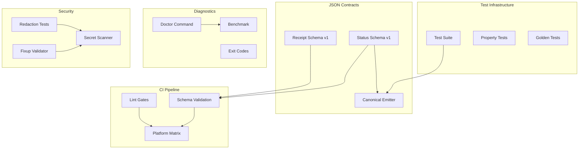

# Design Document

## Overview

This design covers the operational polish phase for xchecker, transforming it from "compiles and passes --no-run" to "green, boring, and production-ready." The focus is on test execution fixes, warning cleanup, process memory tracking, versioned JSON contracts, exit code standardization, and CI automation.

### Core Design Principles

1. **Test Reliability**: All tests pass cleanly across platforms with no flaky behavior
2. **Contract Stability**: Versioned JSON schemas with deterministic emission and validation
3. **Operational Clarity**: Standardized exit codes, process metrics, and diagnostic tooling
4. **Security Validation**: Automated redaction testing and secret scanning in CI
5. **Maintainability**: Intentional warning management with clear removal paths

## Architecture

### High-Level Components



## Components and Interfaces

### 1. Test Execution Fixes


**Pattern Fixes:**

1. **Remove `.await` on non-async helpers**: Scan test files for sync functions incorrectly called with `.await`
2. **Raw string literals for JSON with `#`**: Use `r##"..."##` or higher delimiters for JSON containing `#`
3. **CliArgs initialization**: Ensure all test CliArgs use `..CliArgs::default()` pattern
4. **Property test seeds**: Log seeds on failure and support `--seed <u64>` override

**Implementation:**

```rust
// Before (incorrect)
let result = sync_helper().await;

// After (correct)
let result = sync_helper();

// Before (incorrect)
let json = r#"{"field": "value with # symbol"}"#;

// After (correct)
let json = r##"{"field": "value with # symbol"}"##;

// Before (incomplete)
let args = CliArgs {
    spec_id: "test".to_string(),
    model: Some("claude-3".to_string()),
    // missing fields...
};

// After (correct)
let args = CliArgs {
    spec_id: "test".to_string(),
    model: Some("claude-3".to_string()),
    ..CliArgs::default()
};
```

### 2. Warning Management System

**Strategy:**

- Remove unused re-exports from `lib.rs`
- Add module-scoped `#[allow(dead_code, unused_imports)]` to staged modules
- Tag all suppressions with `TODO(M#): remove when wired`
- Enable `cargo clippy -D warnings` in CI after M2/M3 wiring

**Module Annotations:**

```rust
// packet.rs, redaction.rs, canonicalization.rs, fixup.rs, logging.rs, lock.rs, cache.rs
#![allow(dead_code, unused_imports)] // TODO(M2): remove once wired into status/orchestrator

// In lib.rs - remove gratuitous re-exports
// Before
pub use crate::artifact::{Artifact, ArtifactType};

// After (only if actually used externally)
pub use crate::artifact::Artifact;
```

### 3. Process Memory Tracking

**Design:**

Use `sysinfo` crate to measure process-scoped RSS and commit memory (Windows only).


**Implementation:**

```rust
use sysinfo::{System, SystemExt, PidExt, ProcessExt};

pub struct ProcessMemory {
    pub rss_mb: f64,
    #[cfg(target_os = "windows")]
    pub commit_mb: f64, // private bytes, not virtual size
}

impl ProcessMemory {
    pub fn current() -> Result<Self, anyhow::Error> {
        #[cfg(target_os = "windows")]
        {
            Self::current_windows()
        }
        
        #[cfg(not(target_os = "windows"))]
        {
            Self::current_unix()
        }
    }
    
    #[cfg(not(target_os = "windows"))]
    fn current_unix() -> Result<Self, anyhow::Error> {
        let pid = sysinfo::get_current_pid()?;
        let mut sys = System::new();
        sys.refresh_process(pid);
        
        let process = sys.process(pid)
            .ok_or_else(|| anyhow::anyhow!("Process not found"))?;
        
        let rss_bytes = process.memory() * 1024; // KiB → bytes
        let rss_mb = rss_bytes as f64 / (1024.0 * 1024.0);
        
        Ok(Self { rss_mb })
    }
    
    #[cfg(target_os = "windows")]
    fn current_windows() -> Result<Self, anyhow::Error> {
        use windows::Win32::System::ProcessStatus::{K32GetProcessMemoryInfo, PROCESS_MEMORY_COUNTERS_EX};
        use windows::Win32::System::Threading::GetCurrentProcess;
        
        let mut pmc = PROCESS_MEMORY_COUNTERS_EX::default();
        unsafe {
            K32GetProcessMemoryInfo(
                GetCurrentProcess(),
                &mut pmc as *mut _ as _,
                std::mem::size_of::<PROCESS_MEMORY_COUNTERS_EX>() as u32,
            )?;
        }
        
        let rss_mb = pmc.WorkingSetSize as f64 / (1024.0 * 1024.0);
        let commit_mb = pmc.PrivateUsage as f64 / (1024.0 * 1024.0);
        
        Ok(Self { rss_mb, commit_mb })
    }
    
    pub fn display(&self) -> String {
        #[cfg(target_os = "windows")]
        return format!("RSS: {:.1}MB, Commit: {:.1}MB", self.rss_mb, self.commit_mb);
        
        #[cfg(not(target_os = "windows"))]
        format!("RSS: {:.1}MB", self.rss_mb)
    }
}
```

### 4. JSON Contract System

**Schema Versioning:**

All JSON outputs include `schema_version: "1"` and follow a strict deprecation policy:
- Fields may be added without major bump
- Removals/renames require schema_version bump
- v1 support maintained ≥ 6 months after v2 release

**Canonical Emission:**

Use `BTreeMap` throughout for deterministic key ordering, or apply JCS (RFC 8785) for emission.


**Receipt Schema (v1):**

```rust
#[derive(Serialize, Deserialize)]
pub struct Receipt {
    pub schema_version: String, // "1"
    pub emitted_at: DateTime<Utc>, // RFC3339 UTC
    // NOTE: emitted with canonical JSON (JCS or BTreeMap recursively) for stable diffs
    pub spec_id: String,
    pub phase: String,
    pub xchecker_version: String,
    pub claude_cli_version: String,
    pub model_full_name: String,
    pub model_alias: Option<String>,
    pub canonicalization_version: String,
    pub canonicalization_backend: String,
    pub flags: BTreeMap<String, String>, // sorted keys
    pub runner: &'static str,
    pub runner_distro: Option<String>,
    pub packet: PacketEvidence,
    pub outputs: Vec<FileHash>,
    pub exit_code: i32,
    pub error_kind: Option<ErrorKind>, // NEW
    pub error_reason: Option<String>, // NEW
    pub stderr_tail: Option<String>,
    pub warnings: Vec<String>,
    pub fallback_used: bool,
}

#[derive(Serialize, Deserialize)]
#[serde(rename_all = "snake_case")]
pub enum ErrorKind {
    CliArgs,
    PacketOverflow,
    SecretDetected,
    LockHeld,
    PhaseTimeout,
    ClaudeFailure,
    Unknown,
}
```

**Status Schema (v1):**

Emission MUST use JCS (RFC 8785) or ordered maps (BTreeMap recursively) to ensure stable key ordering.

```rust
#[derive(Serialize, Deserialize)]
pub struct StatusOutput {
    pub schema_version: String, // "1"
    pub emitted_at: DateTime<Utc>, // RFC3339 UTC
    pub runner: &'static str,
    pub runner_distro: Option<String>,
    pub fallback_used: bool,
    pub canonicalization_version: String,
    pub canonicalization_backend: String,
    pub artifacts: Vec<ArtifactInfo>,
    pub last_receipt_path: String,
    pub effective_config: BTreeMap<String, ConfigValue>, // sorted keys, arbitrary JSON values
    pub lock_drift: Option<LockDrift>, // NEW
}

#[derive(Serialize, Deserialize)]
pub struct ArtifactInfo {
    pub path: String,
    pub blake3_first8: String,
}

#[derive(Serialize, Deserialize)]
pub struct ConfigValue {
    pub value: serde_json::Value, // arbitrary JSON
    pub source: ConfigSource,
}

#[derive(Serialize, Deserialize)]
#[serde(rename_all = "lowercase")]
pub enum ConfigSource {
    Cli,
    Config,
    Default,
}

#[derive(Serialize, Deserialize)]
pub struct DriftPair {
    pub locked: String,
    pub current: String,
}

#[derive(Serialize, Deserialize)]
pub struct LockDrift {
    pub model_full_name: Option<DriftPair>,
    pub claude_cli_version: Option<DriftPair>,
    pub schema_version: Option<DriftPair>,
}
```

### 5. Exit Code System

**Standardized Exit Codes:**


```rust
pub mod exit_codes {
    pub const SUCCESS: i32 = 0;
    pub const CLI_ARGS: i32 = 2;
    pub const PACKET_OVERFLOW: i32 = 7;
    pub const SECRET_DETECTED: i32 = 8;
    pub const LOCK_HELD: i32 = 9;
    pub const PHASE_TIMEOUT: i32 = 10;
    pub const CLAUDE_FAILURE: i32 = 70;
}

impl From<&XCheckerError> for (i32, ErrorKind) {
    fn from(err: &XCheckerError) -> (i32, ErrorKind) {
        match err {
            XCheckerError::Config(_) => (exit_codes::CLI_ARGS, ErrorKind::CliArgs),
            XCheckerError::PacketOverflow { .. } => (exit_codes::PACKET_OVERFLOW, ErrorKind::PacketOverflow),
            XCheckerError::SecretDetected { .. } => (exit_codes::SECRET_DETECTED, ErrorKind::SecretDetected),
            XCheckerError::ConcurrentExecution { .. } => (exit_codes::LOCK_HELD, ErrorKind::LockHeld),
            XCheckerError::PhaseTimeout { .. } => (exit_codes::PHASE_TIMEOUT, ErrorKind::PhaseTimeout),
            XCheckerError::Claude(_) => (exit_codes::CLAUDE_FAILURE, ErrorKind::ClaudeFailure),
            _ => (1, ErrorKind::Unknown),
        }
    }
}
```

**Receipt Integration:**

Every non-zero exit writes a receipt with `error_kind` and `error_reason` matching the process exit code.

### 6. Doctor Command

**Purpose:** Preflight checks for environment health and configuration validity.

**Checks:**

Emission MUST use JCS (RFC 8785) or ordered maps (BTreeMap recursively) to ensure stable key ordering.

```rust
#[derive(Serialize, Deserialize)]
pub struct DoctorCheck {
    pub name: String,
    pub status: CheckStatus,
    pub details: String,
}

#[derive(Serialize, Deserialize)]
#[serde(rename_all = "snake_case")]
pub enum CheckStatus {
    Pass,
    Warn,
    Fail,
}

#[derive(Serialize, Deserialize)]
pub struct DoctorOutput {
    pub schema_version: String, // "1"
    pub emitted_at: DateTime<Utc>, // RFC3339 UTC
    pub ok: bool,
    pub checks: Vec<DoctorCheck>,
}

impl DoctorCommand {
    pub fn run() -> Result<DoctorOutput, anyhow::Error> {
        let mut checks = vec![];
        
        // 1. PATH & versions
        checks.push(self.check_claude_path());
        checks.push(self.check_claude_version());
        
        // 2. Runner selection & WSL
        checks.push(self.check_runner_selection());
        checks.push(self.check_wsl_availability());
        checks.push(self.check_wsl_default_distro());
        
        // 3. Write permissions
        checks.push(self.check_write_permissions());
        
        // 4. Same-volume rename test
        checks.push(self.check_atomic_rename());
        
        // 5. Config parsing
        checks.push(self.check_config_parse());
        
        let ok = checks.iter().all(|c| c.status != CheckStatus::Fail);
        Ok(DoctorOutput { ok, checks })
    }
}
```

### 7. Phase Timeout System


**Configuration:**

```rust
pub struct PhaseTimeout {
    pub duration: Duration,
}

impl PhaseTimeout {
    pub const DEFAULT_SECS: u64 = 600;
    pub const MIN_SECS: u64 = 5;
    
    pub fn from_config(config: &Config, cli: &CliArgs) -> Self {
        let secs = cli.phase_timeout
            .or(config.defaults.phase_timeout)
            .unwrap_or(Self::DEFAULT_SECS)
            .max(Self::MIN_SECS);
        
        Self {
            duration: Duration::from_secs(secs),
        }
    }
}
```

**Enforcement:**

```rust
use tokio::time::timeout;

pub async fn execute_phase_with_timeout<F>(
    fut: F,
    phase_id: PhaseId,
    timeout_config: PhaseTimeout,
) -> Result<PhaseResult, XCheckerError>
where
    F: std::future::Future<Output = Result<PhaseResult, XCheckerError>>,
{
    match timeout(timeout_config.duration, fut).await {
        Ok(result) => result,
        Err(_) => {
            // Write partial artifact + receipt with warning
            Err(XCheckerError::PhaseTimeout {
                phase: phase_id,
                timeout_secs: timeout_config.duration.as_secs(),
            })
        }
    }
}

// Usage in orchestrator:
// let result = execute_phase_with_timeout(
//     orchestrator.execute_phase(phase_id, &config),
//     phase_id,
//     timeout_config,
// ).await?;
```

### 8. Receipt and Exit Code Alignment

**Helper to ensure process exit and receipt never drift:**

```rust
pub fn write_error_receipt_and_exit(
    err: &XCheckerError,
    spec_id: &str,
    phase: PhaseId,
) -> ! {
    let (exit_code, error_kind) = err.into();
    let error_reason = err.to_string();
    
    // Write receipt with error details
    let receipt = Receipt {
        schema_version: "1".to_string(),
        emitted_at: Utc::now(),
        spec_id: spec_id.to_string(),
        phase: format!("{:?}", phase),
        exit_code,
        error_kind: Some(error_kind),
        error_reason: Some(error_reason),
        // ... other fields ...
    };
    
    let _ = write_receipt(&receipt);
    std::process::exit(exit_code);
}
```

**Windows Rename Retry Tracking:**

```rust
#[cfg(target_os = "windows")]
pub fn atomic_rename_with_retry(
    from: &Path,
    to: &Path,
) -> Result<Option<u32>, std::io::Error> {
    let mut retry_count = 0;
    let max_retries = 5;
    let mut backoff_ms = 10;
    
    loop {
        match std::fs::rename(from, to) {
            Ok(_) => {
                return Ok(if retry_count > 0 {
                    Some(retry_count)
                } else {
                    None
                });
            }
            Err(e) if retry_count < max_retries && is_transient_error(&e) => {
                retry_count += 1;
                std::thread::sleep(Duration::from_millis(backoff_ms));
                backoff_ms = (backoff_ms * 2).min(100);
            }
            Err(e) => return Err(e),
        }
    }
}

// Helper to append retry count to receipt warnings
pub fn add_rename_retry_warning(warnings: &mut Vec<String>, retry_count: Option<u32>) {
    if let Some(count) = retry_count {
        warnings.push(format!("rename_retry_count: {}", count));
    }
}
```

### 9. Security Validation

**Redaction Testing:**

```rust
#[test]
fn test_packet_preview_redacted() {
    let packet = build_test_packet_with_secrets();
    let preview = packet.to_preview();
    
    // Assert no default patterns present
    assert!(!preview.contains("ghp_"));
    assert!(!preview.contains("AKIA"));
    assert!(!preview.contains("AWS_SECRET_ACCESS_KEY"));
    assert!(!preview.contains("xox"));
    assert!(!preview.contains("Bearer "));
}

#[test]
fn test_receipt_no_raw_packet() {
    let receipt = create_test_receipt();
    let json = serde_json::to_string(&receipt).unwrap();
    
    // Assert receipt doesn't embed raw packet content
    assert!(!json.contains("raw_packet"));
    assert!(!json.contains("packet_content"));
}
```

**Fixup Path Validation:**

Targets escaping the repo root after symlink resolution are rejected. On Windows, path comparisons use normalized representation (case-insensitive).

```rust
pub fn validate_fixup_target(path: &Path, repo_root: &Path) -> Result<(), FixupError> {
    // Reject absolute paths
    if path.is_absolute() {
        return Err(FixupError::AbsolutePath(path.to_path_buf()));
    }
    
    // Reject .. escapes
    if path.components().any(|c| matches!(c, std::path::Component::ParentDir)) {
        return Err(FixupError::ParentDirEscape(path.to_path_buf()));
    }
    
    // Ensure resolves within repo root (follows symlinks)
    let resolved = repo_root.join(path).canonicalize()?;
    
    // Normalize for case-insensitive comparison on Windows
    #[cfg(target_os = "windows")]
    let (resolved, repo_root) = {
        let resolved = dunce::canonicalize(&resolved)?;
        let repo_root = dunce::canonicalize(repo_root)?;
        (resolved, repo_root)
    };
    
    if !resolved.starts_with(&repo_root) {
        return Err(FixupError::OutsideRepo(resolved));
    }
    
    Ok(())
}
```

**Windows Rename Retry Tracking:**


```rust
#[cfg(target_os = "windows")]
pub fn atomic_rename_with_retry(
    from: &Path,
    to: &Path,
) -> Result<Option<u32>, std::io::Error> {
    let mut retry_count = 0;
    let max_retries = 5;
    let mut backoff_ms = 10;
    
    loop {
        match std::fs::rename(from, to) {
            Ok(_) => {
                return Ok(if retry_count > 0 {
                    Some(retry_count)
                } else {
                    None
                });
            }
            Err(e) if retry_count < max_retries && is_transient_error(&e) => {
                retry_count += 1;
                std::thread::sleep(Duration::from_millis(backoff_ms));
                backoff_ms = (backoff_ms * 2).min(100);
            }
            Err(e) => return Err(e),
        }
    }
}
```

### 9. Lockfile System

**Lock Structure:**

```rust
#[derive(Serialize, Deserialize)]
pub struct XCheckerLock {
    pub schema_version: String, // "1"
    pub created_at: DateTime<Utc>,
    pub model_full_name: String,
    pub claude_cli_version: String,
}

impl XCheckerLock {
    pub fn detect_drift(&self, current: &RunContext) -> Option<LockDrift> {
        let mut drift = LockDrift {
            model_full_name: None,
            claude_cli_version: None,
            schema_version: None,
        };
        
        if self.model_full_name != current.model_full_name {
            drift.model_full_name = Some(DriftPair {
                locked: self.model_full_name.clone(),
                current: current.model_full_name.clone(),
            });
        }
        
        if self.claude_cli_version != current.claude_cli_version {
            drift.claude_cli_version = Some(DriftPair {
                locked: self.claude_cli_version.clone(),
                current: current.claude_cli_version.clone(),
            });
        }
        
        if self.schema_version != current.schema_version {
            drift.schema_version = Some(DriftPair {
                locked: self.schema_version.clone(),
                current: current.schema_version.clone(),
            });
        }
        
        if drift.model_full_name.is_none() 
            && drift.claude_cli_version.is_none() 
            && drift.schema_version.is_none() {
            None
        } else {
            Some(drift)
        }
    }
}
```

### 10. CI Pipeline Design

**Workflow Structure:**

Note: Enable `cargo clippy -D warnings` after status --json is wired (consumes unused fields) and staged modules remove their temporary #[allow]. Keep TODO(M#) tags mandatory in allows.

```yaml
name: CI

on: [push, pull_request]

jobs:
  lint:
    runs-on: ubuntu-latest
    steps:
      - uses: actions/checkout@v3
      - run: cargo fmt -- --check
      - run: cargo clippy -D warnings  # Enable after M2/M3 wiring complete
  
  test-stub:
    strategy:
      matrix:
        os: [ubuntu-latest, macos-latest, windows-latest]
    runs-on: ${{ matrix.os }}
    steps:
      - uses: actions/checkout@v3
      - run: cargo test --all-features
      - if: runner.os == 'Windows'
        run: cargo test wsl_probe -- --ignored
  
  schema-validation:
    runs-on: ubuntu-latest
    steps:
      - uses: actions/checkout@v3
      - run: cargo test schema_validation
  
  test-real:
    if: github.event_name == 'push' && github.ref == 'refs/heads/main'
    runs-on: ubuntu-latest
    steps:
      - uses: actions/checkout@v3
      - run: cargo test --test smoke -- --ignored
    env:
      CLAUDE_API_KEY: ${{ secrets.CLAUDE_API_KEY }}
```

## Data Models

### Spec ID Sanitization


```rust
pub fn sanitize_spec_id(id: &str) -> Result<String, SpecIdError> {
    let sanitized: String = id
        .chars()
        .map(|c| {
            if c.is_alphanumeric() || c == '.' || c == '_' || c == '-' {
                c
            } else {
                '_'
            }
        })
        .collect();
    
    if sanitized.is_empty() {
        return Err(SpecIdError::Empty);
    }
    
    if sanitized != id {
        eprintln!("Warning: spec ID sanitized from '{}' to '{}'", id, sanitized);
    }
    
    Ok(sanitized)
}
```

## Error Handling

### Enhanced Error Types

```rust
#[derive(Error, Debug)]
pub enum XCheckerError {
    // ... existing variants ...
    
    #[error("Phase timeout: {phase:?} exceeded {timeout_secs}s")]
    PhaseTimeout {
        phase: PhaseId,
        timeout_secs: u64,
    },
    
    #[error("Fixup path validation failed: {0}")]
    FixupPath(#[from] FixupError),
}

#[derive(Error, Debug)]
pub enum FixupError {
    #[error("Absolute path not allowed: {0}")]
    AbsolutePath(PathBuf),
    
    #[error("Parent directory escape not allowed: {0}")]
    ParentDirEscape(PathBuf),
    
    #[error("Path resolves outside repo: {0}")]
    OutsideRepo(PathBuf),
}
```

## Testing Strategy

### Unit Tests

1. **Exit Code Mapping**: Verify each error type maps to correct exit code
2. **JSON Canonicalization**: Test BTreeMap ordering produces stable output
3. **Memory Measurement**: Mock sysinfo and verify calculations
4. **Path Sanitization**: Test various invalid characters and edge cases
5. **Timeout Enforcement**: Test timeout triggers and partial artifact creation

### Integration Tests

1. **Doctor Command**: Run full doctor checks and verify JSON output
2. **Status JSON**: Verify schema compliance and key ordering
3. **Lockfile Drift**: Test detection and reporting of version drift
4. **Fixup Validation**: Test path rejection for absolute and escaped paths

### Schema Validation Tests

```rust
#[test]
fn test_receipt_schema_v1_minimal() {
    let receipt = create_minimal_receipt();
    let json = serde_json::to_value(&receipt).unwrap();
    
    let schema = load_schema("schemas/receipt.v1.json");
    assert!(schema.validate(&json).is_ok());
}

#[test]
fn test_receipt_schema_v1_full() {
    let receipt = create_full_receipt();
    let json = serde_json::to_value(&receipt).unwrap();
    
    let schema = load_schema("schemas/receipt.v1.json");
    assert!(schema.validate(&json).is_ok());
}

#[test]
fn test_status_schema_v1_minimal() {
    let status = create_minimal_status();
    let json = serde_json::to_value(&status).unwrap();
    
    let schema = load_schema("schemas/status.v1.json");
    assert!(schema.validate(&json).is_ok());
}

#[test]
fn test_status_schema_v1_full() {
    let status = create_full_status();
    let json = serde_json::to_value(&status).unwrap();
    
    let schema = load_schema("schemas/status.v1.json");
    assert!(schema.validate(&json).is_ok());
}

#[test]
fn test_doctor_schema_v1() {
    let doctor = create_sample_doctor_output();
    let json = serde_json::to_value(&doctor).unwrap();
    
    let schema = load_schema("schemas/doctor.v1.json");
    assert!(schema.validate(&json).is_ok());
}

#[test]
fn test_nested_key_ordering_stable() {
    // Verify BTreeMap ordering is recursive (nested objects)
    let config1 = create_config_with_nested_maps();
    let config2 = create_config_with_nested_maps_different_insertion_order();
    
    let json1 = serde_json::to_string(&config1).unwrap();
    let json2 = serde_json::to_string(&config2).unwrap();
    
    assert_eq!(json1, json2, "Nested key ordering must be stable");
}
```

## Performance Considerations

### Memory Tracking Overhead

- `sysinfo` refresh is lightweight (~1ms)
- Only measure at benchmark start/end, not during execution
- Cache System instance to avoid repeated initialization

### JSON Emission

- BTreeMap ordering adds minimal overhead vs HashMap
- Consider lazy serialization for large configs
- Reuse serializer instances where possible

## Deployment and Operations

### Schema Files

Create `schemas/receipt.v1.json` and `schemas/status.v1.json` with JSON Schema definitions.

Include minimal and full examples in `docs/schemas/`.

### Documentation Updates

1. **CHANGELOG.md**: Document all new fields and exit codes
2. **README.md**: Add doctor command usage and exit code reference
3. **docs/CONTRACTS.md**: Document JSON schema versioning policy

### Migration Path

1. Add `schema_version` field to existing receipts (default "1")
2. Update status command to emit new JSON format
3. Add deprecation warnings for any removed fields
4. Maintain backward compatibility for 6 months

## Security Considerations

### Secret Scanning

- CI scans all receipts and packet previews for default patterns
- Fail build if any secrets detected
- Never log or emit raw packet content

### Fixup Safety

- Reject absolute paths and parent directory escapes
- Validate all targets resolve within repo root
- Record all fixup operations in receipts with full paths

### Environment Isolation

- Never include environment variables in receipts or status
- Redact any accidentally captured env vars before emission
- Audit all JSON output for PII/secrets

## Observability

### Doctor Output Example

```json
{
  "schema_version": "1",
  "emitted_at": "2025-10-23T14:30:00Z",
  "ok": true,
  "checks": [
    {
      "name": "claude_path",
      "status": "pass",
      "details": "Found claude at /usr/local/bin/claude"
    },
    {
      "name": "claude_version",
      "status": "pass",
      "details": "0.8.1"
    },
    {
      "name": "runner_selection",
      "status": "pass",
      "details": "native (claude in PATH)"
    },
    {
      "name": "wsl_availability",
      "status": "warn",
      "details": "WSL not installed (Windows only)"
    }
  ]
}
```

### Status JSON Example

```json
{
  "schema_version": "1",
  "emitted_at": "2025-10-23T14:30:00Z",
  "runner": "native",
  "runner_distro": null,
  "fallback_used": false,
  "canonicalization_version": "yaml-v1,md-v1",
  "canonicalization_backend": "jcs-rfc8785",
  "artifacts": [
    {"path": "artifacts/00-requirements.md", "blake3_first8": "abc12345"},
    {"path": "artifacts/10-design.md", "blake3_first8": "def67890"}
  ],
  "last_receipt_path": "receipts/10-design.json",
  "effective_config": {
    "model": {"value": "claude-sonnet-4", "source": "cli"},
    "max_turns": {"value": 6, "source": "config"},
    "packet_max_bytes": {"value": 65536, "source": "default"}
  },
  "lock_drift": {
    "model_full_name": {
      "locked": "claude-sonnet-4-20250101",
      "current": "claude-sonnet-4-20250201"
    }
  }
}
```

## Summary

This design provides a comprehensive operational polish layer that transforms xchecker from a working prototype into a production-ready tool. The focus on contract stability, diagnostic tooling, security validation, and CI automation ensures the tool is "green, boring, and trustable everywhere."
